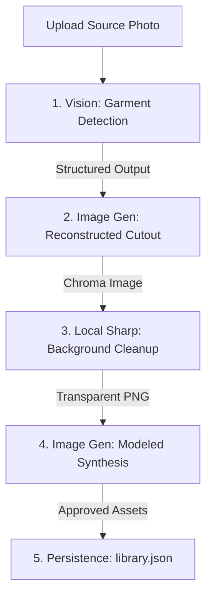

# Technical Reference: Business Logic and Tokenomics

## Status
- Reference State: Ready
- Integration readiness: This document outlines the existing pipeline mechanics implemented in `scripts/import-job-api.mjs`, `.agents/skills/import-clothes/SKILL.md`, and `src/import-flow.jsx`.

## Context and Scope
### Problem
The Wardrobe application blends server-side Node.js logic (via Vite middleware), client-side Canvas operations, and external OpenAI Multi-Modal Vision and Image APIs. Developers and AI agents operating in the workspace need a single source of truth describing exactly *how* a photo is parsed into a catalog item, and *what* it costs in OpenAI API tokens/dollars to process collections.

### Desired Outcome
Provide an explicit breakdown of the multi-stage ingestion pipeline (Business Logic) and a detailed financial and token-usage reference (Tokenomics) to guide future feature designs, budget estimations, and optimization strategies.

---

## The Ingestion Business Logic Pipeline

The core task of Wardrobe is to take an everyday photo of a person wearing an outfit and produce a clean, isolated, transparent catalog item along with a realistic modeling shoot of that person wearing the item. 

The pipeline proceeds through five main stages:

### Stage 1: Garment Detection & Metadata Extraction (Vision)
* **API Used:** OpenAI Chat Completions (Structured Outputs via Response format).
* **Endpoint:** `POST /v1/chat/completions` (routed through `/api/import/jobs`).
* **Model:** Configured via `OPENAI_VISION_MODEL`, defaulting to `gpt-5.4-mini` (or standard `gpt-4o-mini`/`gpt-4o`).
* **Operation:** 
  1. The user uploads a source photo.
  2. The system sends the photo to the vision model alongside instructions to locate the target garment.
  3. The model returns a strict JSON object containing a bounding box (`x, y, width, height` on a 0-1000 scale), category `part` (`upperbody`, `wholebody_up`, `lowerbody`, `accessories_up`, `shoes`), primary hex color, optional secondary color, a descriptive name, and up to 12 design tags.

### Stage 2: Crop & AI Reconstruction (Reconstructed Cutout)
* **API Used:** OpenAI Images Edit/Generation API (DALL-E 3 / `gpt-image-2`).
* **Endpoint:** `POST /v1/images/edits` (via `/api/import/jobs`).
* **Operation:**
  1. The server crops the source image closely around the returned bounding box with roughly ~8%-12% extra padding to isolate the item.
  2. The cropped image is sent to DALL-E 3 with a detailed reconstruction prompt (generated via `buildGarmentPrompt`).
  3. DALL-E 3 is instructed to completely remove the person, skin, hanger, underlayers, and environment, and draw *only* the empty, naturally arranged garment centered on a solid edge-to-edge chroma-key background (defaults to saturated green `#00ff00` or magenta `#ff00ff`).

### Stage 3: Local Chroma-Key Background Extraction (The Matte Optimization)
* **Library Used:** `sharp` (Local node process, completely free of API costs).
* **Operation:**
  1. Once the chroma-keyed image is returned from OpenAI, it undergoes post-processing.
  2. The server scans the borders to automatically locate the keying color, removes the background entirely, generates a transparent alpha channel, and applies a soft feathering matte.
  3. It executes a "despill" algorithm to remove any neon green/magenta reflection tinting bleeding into the edges of the clothing.
  4. **The Cleanup Slider:** If the automated cleanup is too aggressive or misses background pixels, the user can adjust the tolerance (strength range: 18-110) in the web UI. This triggers a **local** recalculation on the original source-chroma PNG, letting the user fix edge defects instantly without calling OpenAI again.

### Stage 4: Modeled Editorial Synthesis
* **API Used:** OpenAI Images API.
* **Operation:**
  1. The system reads the user's permanent selfie portrait from `data/model-reference.png` (or custom `WARDROBE_MODEL_REFERENCE`).
  2. It sends both the user's reference portrait (Image 1) and the transparent garment cutout (Image 2) to DALL-E 3.
  3. The model is commanded to synthesize a highly detailed 3:2 horizontal editorial fashion photograph. The prompt enforces that DALL-E 3 preserves the user's recognizable face, age, build, and proportions while dressing them in the exact color, material, and construction of the cutout.

### Stage 5: Local Database & File Persistence
* **Operation:**
  1. When the user approves the modeled image, the system wraps up the temporary job.
  2. It moves the final isolated transparent garment (`{id}-garment.png`) and the generated editorial shot (`{id}-modeled.png`) into `data/imported/`.
  3. It updates `data/library.json` by appending the metadata record (ID, name, colors, category, tags, and asset paths).
  4. The temporary jobs directory in `data/jobs/{uuid}` is purged.

---

## Tokenomics & API Cost Analysis

OpenAI charges for multi-modal completions (vision) based on token volume, while image generation (DALL-E 3) is billed at a flat rate per generated image.

### 1. Cost Components per Ingested Garment

| Ingestion Step | API Call | Details & Token/Image Sizes | Base Cost (USD) |
| :--- | :--- | :--- | :--- |
| **1. Vision Detection** | Chat Completions | Input: 1 high-res image (approx. 1105 vision tokens + 500 prompt tokens). Output: Structured JSON output (~250 tokens). | **~$0.0003** (on `gpt-4o-mini`) |
| **2. Cutout Gen** | Images API | DALL-E 3 Standard (`1024x1024`) generation. | **$0.040** (Standard) **$0.080** (HD Quality) |
| **3. Chroma Matte** | Sharp (Local) | *Processed locally on your machine.* | **$0.000** |
| **4. Modeled Shoot** | Images API | DALL-E 3 Standard (`1024x1024` or `1536x1024`) generation. | **$0.040** (Standard) **$0.080** (HD Quality) |

> 📊 **Baseline Cost Per Ingestion:** **~$0.08** (Standard) or **~$0.16** (HD Quality) per successful garment.

---

### 2. Scaled Cost Analysis (X Number of Photos)

The table below outlines cumulative costs based on standard and high-definition quality settings:

| Number of Items ($X$) | Baseline Standard Cost (DALL-E Standard) | Premium High-Fidelity Cost (DALL-E HD) |
| :--- | :--- | :--- |
| **1 Item** | ~$0.08 | ~$0.16 |
| **10 Items** | ~$0.80 | ~$1.60 |
| **25 Items** | ~$2.00 | ~$4.00 |
| **50 Items** | ~$4.00 | ~$8.00 |
| **100 Items** | ~$8.00 | ~$16.00 |
| **250 Items** | ~$20.00 | ~$40.00 |

---

### 3. Standard vs. HD Quality: Key Operational Trade-offs

Choosing between Standard and HD image quality involves several critical technical and user experience trade-offs beyond just the doubled price point:

1. **Generation Latency (Wait Time):**
   * **Standard:** Typically completes in **4 to 8 seconds**.
   * **HD:** Requires a deeper, more detailed diffusion process, taking **12 to 25 seconds** per generation. Because our ingestion flow is an interactive multi-stage UI, selecting HD significantly increases the waiting states during both the *Cutout Gen* and *Modeled Shoot* stages.
2. **Local Chroma-Key Matte Precision:**
   * **Standard:** Can sometimes introduce faint edge compression artifacts and minor color-bleeding.
   * **HD:** Renders crisp, precise outlines and cleaner transitions between the garment and the solid chroma background. This results in a cleaner matte cut from `sharp` with far fewer halos and less manual cleanup needed.
3. **Texture Detail & Facial Preservation:**
   * **Standard:** Tends to smooth out intricate textures (e.g., knit, stitching, weave pattern) and may warp face details in the modeling step.
   * **HD:** Retains rich textile textures and achieves far higher fidelity when blending the user's face from the reference portrait in Stage 4.
4. **Rate Limits & Batching:**
   * **Standard:** More forgiving on OpenAI's Images API rate limits (requests/minute).
   * **HD:** Tighter rate limits apply, meaning automated batch ingestion (e.g., via the `import-clothes` skill) must be carefully throttled to avoid throttling/429 errors.

---

### 4. Key Cost Optimization Strategies Implemented

To keep running costs as low as possible, the Wardrobe pipeline employs three critical design choices:

1. **Local Background Keying (Post-Processing):** Rather than asking OpenAI to generate an image with an alpha transparent background directly (which DALL-E 3 does not support) or using an external paid background removal API, Wardrobe generates a flat solid-color chroma key and cuts it out locally using `sharp`.
2. **Infinite Free Local Edits:** The local matte-cleanup slider operates strictly on the computer's CPU/GPU. The user can refine edge pixels, halos, and thresholds endlessly without repeating expensive API requests.
3. **Multi-Stage User Approvals:** By forcing user approvals at intermediate stages (Crop, Cutout, and Modeled), the pipeline prevents starting the next expensive generation stage if the previous stage was unsatisfactory, drastically reducing wasted image tokens.

---

## Risks and Alternatives

### Risks & Mitigations
* **Accidental Regenerations:** If a user repeatedly clicks "Regenerate" on the modeled or garment step (e.g., trying to get the perfect posture or background), each retry costs an additional flat fee ($0.04 to $0.08).
  * *Mitigation:* The prompt field allows users to add explicit styling text before regenerating to prevent blind retries.
* **Rate Limits:** Ingesting 50+ photos concurrently via the Codex Agent script can hit OpenAI Images API rate limits (e.g., images-per-minute limits).
  * *Mitigation:* The `.agents/skills/import-clothes/SKILL.md` instructs agents to process batches in small waves, allowing rate limits to reset between calls.
* **Large File Sizes:** Storing high-res model references and PNG outputs locally can consume disk space.
  * *Mitigation:* Standardize output sizes to `1024x1024` or `1536x1024` and rely on the IPX plugin (`_ipx`) to compress and serve responsive resized WebP cached assets on the fly.
