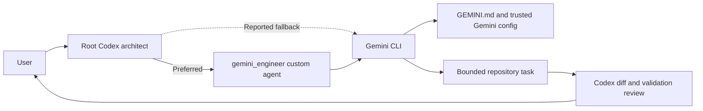

# Feature Implementation Plan: Gemini Delegation Workflow

## Status
- Planning state: Ready
- Implementation readiness: The repository already contains the required Codex custom agent and Gemini context file; this plan standardizes selection, invocation, verification, and fallback behavior.

## Problem and Outcome
### Problem
Wardrobe supports both direct Gemini CLI execution and delegation through the Codex `gemini_engineer` custom agent. Without an explicit operational contract, an architect can overlook the configured subagent, use the CLI fallback prematurely, or make unverified claims about which context Gemini loaded.

### Desired user outcome
Routine engineering work consistently uses the repository-defined `gemini_engineer` agent when available. Direct CLI execution remains a transparent fallback. Both paths launch Gemini from the repository root, use the correct approval mode, follow `GEMINI.md`, preserve private data and unrelated changes, and return reviewable results to the Codex architect.

### In scope
- Choosing between `gemini_engineer` and direct Gemini CLI.
- Gemini CLI command shapes for read-only and write tasks.
- Responsibilities of Codex, the custom subagent, and Gemini CLI.
- Context-loading expectations and explicit verification.
- Required prompt contents, validation, result reporting, and fallback behavior.
- Documentation/configuration changes needed to make the workflow durable.

### Out of scope
- Replacing Gemini CLI or changing its model.
- Modifying Wardrobe application behavior.
- Adding credentials, secrets, or personal data to agent configuration.
- Enabling `--yolo` or weakening sandbox/approval policies.
- Requiring delegation for trivial work or specialized Codex-skill tasks.

## Acceptance Criteria
- [ ] Codex inspects `.codex/agents/` before choosing a Gemini delegation path.
- [ ] When selectable, routine work uses the custom agent whose TOML `name` is `gemini_engineer`.
- [ ] The custom agent launches Gemini CLI from the repository root with `-p` for a headless one-off request.
- [ ] Read-only work uses `--approval-mode plan`; authorized implementation uses `--approval-mode auto_edit`; no workflow uses `--yolo`.
- [ ] Every delegated prompt names the objective, file scope, constraints, acceptance criteria, validation commands, preservation rules, and expected report.
- [ ] Every Gemini prompt explicitly instructs Gemini to read and follow `GEMINI.md`, even though a trusted repository-root invocation should load it automatically.
- [ ] Direct Gemini CLI use occurs only after custom-agent selection is unavailable or spawning fails, and the fallback is reported to the user.
- [ ] Codex independently reviews Gemini's findings or diff and confirms appropriate validation before completing the task.
- [ ] No prompt, output, configuration, or commit exposes `.env`, API keys, `data/`, personal photos, or generated wardrobe assets.

## Investigation Findings
### Relevant files and current responsibilities
- `AGENTS.md`: defines the architect–engineer split, delegation preference, prompt requirements, fallback rules, review duties, and validation expectations.
- `.codex/agents/gemini-engineer.toml`: defines the project-scoped Codex custom agent named `gemini_engineer`; that agent acts as a thin wrapper around Gemini CLI.
- `GEMINI.md`: supplies Gemini with Wardrobe architecture, conventions, commands, and privacy rules.
- `.gitignore`: prevents private runtime files and generated data from entering source control.
- `package.json`: supplies the required `npm run check` validation command.

### Current flow and architecture
The preferred path has two orchestration layers:

1. The root Codex agent acts as architect and final reviewer.
2. Codex selects the project custom agent `gemini_engineer` from `.codex/agents/gemini-engineer.toml`.
3. The custom agent launches Gemini CLI from the Wardrobe repository root.
4. Gemini CLI performs the bounded read or write task and returns structured JSON.
5. The custom agent lightly verifies and summarizes the result.
6. Root Codex inspects the result/diff, independently validates it, and reports to the user.

The fallback removes step 2: root Codex runs the same Gemini CLI command directly and explicitly tells the user that the configured custom-agent path was unavailable or failed.

### Dependencies and integration points
- Codex custom-agent discovery uses project-scoped TOML files under `.codex/agents/`; the `name` field, not the filename, is the agent identity.
- Gemini CLI must be installed and callable as `gemini`.
- Gemini CLI context discovery depends on invocation location and workspace trust. Running from the repository root is required.
- `GEMINI.md` is Gemini-facing context. `AGENTS.md` and `.codex/agents/gemini-engineer.toml` are Codex-facing orchestration instructions; the delegation prompt should explicitly tell Gemini to read `AGENTS.md` when its task requires those rules.
- CLI flags override lower-precedence Gemini settings for approval and output mode.

### Constraints and challenges
- A Gemini response can misunderstand an ambiguous meta-question. For example, “startup” may be interpreted as Wardrobe application startup rather than Gemini CLI startup.
- Gemini's final JSON response does not necessarily include a manifest proving which context files were loaded.
- A project custom agent may exist on disk but be unavailable for selection on a particular Codex surface or may require a new trusted session after configuration changes.
- Raw Gemini output is captured as tool/subagent output and may not appear directly in the user-facing transcript; Codex must summarize material findings truthfully.
- Direct positional prompts can work, but `-p` is the explicit and preferred headless one-off interface.

## Technical Design
### Proposed architecture
Use `gemini_engineer` as the normal execution adapter and direct Gemini CLI as a behaviorally equivalent fallback. Keep root Codex responsible for architecture, scoping, security-sensitive decisions, acceptance criteria, and final review.

Selection algorithm:

```text
Read AGENTS.md and inspect .codex/agents/*.toml
  -> find name = "gemini_engineer"
  -> if the current Codex surface can select it, spawn it
  -> if selection is unavailable or spawn fails, report fallback and run Gemini CLI directly
  -> review output/diff and independently validate
```

### User experience and state behavior
- Before delegation, Codex briefly states that it is using `gemini_engineer` and why.
- If direct CLI fallback is necessary, Codex states the exact reason rather than silently switching paths.
- During a longer run, Codex gives concise progress updates; raw JSON remains internal unless the user asks to inspect it.
- The final response identifies what Gemini did, what Codex independently verified, validation results, changed files, and unresolved risks.

### Data and interface contracts
Custom agent identity:

```toml
name = "gemini_engineer"
```

Read-only CLI contract:

```sh
gemini --approval-mode plan --output-format json -p "<bounded task prompt>"
```

Implementation CLI contract:

```sh
gemini --approval-mode auto_edit --output-format json -p "<bounded task prompt>"
```

Every bounded prompt must contain:

- Concrete objective and relevant file scope.
- Constraints and observable acceptance criteria.
- Required validation commands, including `npm run check` for code changes.
- Instructions to read `GEMINI.md` and applicable `AGENTS.md` files.
- Instructions to preserve unrelated user changes, avoid secrets, and never commit.
- Instructions to return changed files, validation results, and unresolved risks concisely.

For a meta-question about Gemini itself, disambiguate the subject explicitly:

```text
Investigate Gemini CLI process startup—not Wardrobe/Vite application startup.
Determine which repository context and settings the one-off CLI invocation loads.
```

### Error handling and recovery
- Custom-agent file missing: verify `.codex/agents/` and the TOML `name`; use direct CLI only if it is genuinely absent.
- Custom agent not selectable: note the current Codex surface limitation, use direct CLI, and recommend restarting/opening a new trusted session if the file was recently added.
- Custom-agent spawn failure: report the error, then run the bounded direct CLI fallback once when safe.
- Gemini CLI unavailable: report the exact command error; do not invent findings or bypass the repository's engineer policy silently.
- Ambiguous or incorrect Gemini answer: refine the prompt once with explicit subject boundaries, rerun if useful, and have Codex independently verify the corrected result.
- Gemini command still running: poll the process and keep the user updated; do not treat an early informational line such as a search-tool fallback as completion.
- Validation failure: Gemini reports it and returns control; root Codex diagnoses, retries once if efficient, or takes over only under the documented criteria.

### Privacy and security
- Never include secrets or API keys in delegation prompts or surfaced command output.
- Never stage or commit `.env`, `data/`, personal photos, model references, or generated assets.
- Do not use `--yolo`; use `plan` for read-only work and `auto_edit` only for user-authorized repository modifications.
- Treat automatically loaded environment files as potentially sensitive; prompts must not ask Gemini to print environment contents.
- Preserve unrelated worktree changes and never commit unless the user explicitly requests a commit.

### Compatibility and migration
No Wardrobe runtime migration is required. Existing `AGENTS.md`, `GEMINI.md`, and `.codex/agents/gemini-engineer.toml` already establish most of the workflow. Implementation is a documentation/configuration consistency pass and should remain compatible with direct Gemini CLI use on surfaces that cannot select custom agents.

### Diagram


## Implementation Checklist
- [ ] Reconcile delegation language in `AGENTS.md` with the exact selection and fallback algorithm.
- [ ] Confirm `.codex/agents/gemini-engineer.toml` launches Gemini from the repository root and requires complete bounded prompts.
- [ ] Document the context boundary between Codex configuration and Gemini configuration.
- [ ] Add an explicit context-verification/reporting requirement without relying on unsupported certainty.
- [ ] Validate both read-only and authorized write command forms.
- [ ] Confirm privacy, worktree-preservation, no-commit, and final-review rules remain intact.

## Step-by-Step Implementation
### Step 1: Make agent discovery deterministic
- Files: `AGENTS.md`, `.codex/agents/gemini-engineer.toml`
- Changes: Require inspection of `.codex/agents/`, selection using `name = "gemini_engineer"`, and a reported direct-CLI fallback only when selection is unavailable or spawning fails.
- Contracts: Filename matching is conventional; the TOML `name` field is authoritative.
- Edge cases: A newly added or modified custom-agent file may require a new trusted Codex session before selection.
- Validation: Start a fresh Codex session in the trusted repository, request routine delegated work, and confirm the visible subagent is identified as `gemini_engineer` or one of its configured nicknames.

### Step 2: Standardize bounded Gemini commands
- Files: `AGENTS.md`, `.codex/agents/gemini-engineer.toml`
- Changes: Retain the explicit `-p` headless interface, JSON output, `plan` mode for investigation, and `auto_edit` for authorized changes. State that `--yolo` is prohibited.
- Contracts: Commands must execute with `/Users/yannipeng/git-projects/wardrobe` as the working directory.
- Edge cases: Avoid putting shell-sensitive content or secrets into command strings. Prompts should be bounded and quoted safely.
- Validation: Run a harmless read-only prompt and confirm exit code 0 plus valid JSON containing `session_id`, `response`, and stats.

### Step 3: Clarify context ownership and loading
- Files: `AGENTS.md`, `GEMINI.md`, `.codex/agents/gemini-engineer.toml`
- Changes: Document that Codex consumes `AGENTS.md` and the custom-agent TOML, while the Gemini process consumes `GEMINI.md` and applicable trusted Gemini settings. Continue explicitly instructing Gemini to read `GEMINI.md` and applicable `AGENTS.md` files.
- Contracts: Do not claim that Gemini loaded a particular context file solely because the file exists; distinguish expected automatic loading from evidence in the captured run.
- Edge cases: Untrusted workspace mode or invocation outside the repository root may suppress or change project-local context discovery.
- Validation: Ask a narrowly worded Gemini CLI meta-question about “Gemini CLI process startup” and compare its response with the repository location and invocation directory; record uncertainty if no context manifest is available.

### Step 4: Require transparent review and reporting
- Files: `AGENTS.md`, `.codex/agents/gemini-engineer.toml`
- Changes: Require the engineer to report files inspected/changed, validation commands/results, and unresolved risks. Require root Codex to inspect the diff and independently confirm appropriate checks before completion.
- Contracts: Early stderr or progress messages are not the final result; wait for process completion and inspect the exit code and structured response.
- Edge cases: If Gemini's summary omits a required file or check, Codex must verify it directly or request one bounded retry.
- Validation: Exercise one read-only task and one small authorized documentation edit; ensure both final reports identify the path used (custom agent or fallback) and distinguish Gemini findings from Codex verification.

### Step 5: Validate repository safety and application integrity
- Files: `.gitignore`, `package.json`, affected documentation/configuration files
- Changes: No application behavior changes. Confirm the workflow cannot surface or commit ignored private state.
- Contracts: Run `npm run check` for any implementation/configuration change that could affect application behavior; documentation-only wording changes may record the check as not required, but the final workflow validation should include it once.
- Edge cases: Existing unrelated changes must remain untouched and must not be attributed to Gemini.
- Validation: Run `npm run check`, inspect `git diff`, and confirm `git status --short` contains no `.env` or `data/` paths.

## Validation Strategy
### Automated checks
- Confirm agent configuration: `grep -n 'name = "gemini_engineer"' .codex/agents/gemini-engineer.toml`
- Confirm command policy text: search `AGENTS.md` and the agent TOML for `--approval-mode plan`, `--approval-mode auto_edit`, and the `--yolo` prohibition.
- Run one read-only delegated prompt using the custom agent from a fresh trusted session.
- If testing fallback, run `gemini --approval-mode plan --output-format json -p "<unambiguous bounded prompt>"` from the repository root.
- Run `npm run check` after the workflow documentation/configuration is finalized.
- Review `git diff` and `git status --short` for scope and private-file safety.

### Manual scenarios
1. Ask Codex to perform routine read-only repository exploration and confirm it selects `gemini_engineer`.
2. Inspect the spawned agent activity and verify that it invokes Gemini CLI rather than independently implementing with Codex.
3. Ask an unambiguous Gemini CLI context-loading question and confirm the response addresses Gemini CLI startup rather than Vite/Wardrobe startup.
4. Simulate a surface where custom-agent selection is unavailable and confirm Codex announces the direct CLI fallback before running it.
5. Perform a small authorized edit and confirm `auto_edit`, required validation, diff review, and preservation of unrelated changes.
6. Ask for the exact Gemini command afterward and confirm Codex can report it without leaking sensitive prompt content.

### Expected results
Routine delegated tasks visibly use `gemini_engineer`; Gemini runs from the repository root with the correct mode and structured output; context expectations are accurately described; fallback is exceptional and transparent; and Codex retains final architectural and validation responsibility.

## Risks and Alternatives
### Risks and mitigations
- Custom agent exists but is overlooked: mandate `.codex/agents/` inspection before delegation.
- Context-loading claim is overstated: explicitly distinguish expected behavior from captured evidence and use unambiguous verification prompts.
- Nested orchestration hides output: summarize material Gemini results and make the spawned agent activity available for inspection when the surface supports it.
- Direct CLI and custom-agent behavior drift: keep canonical commands and prompt requirements synchronized between `AGENTS.md` and `.codex/agents/gemini-engineer.toml`.
- Sensitive environment values are exposed: prohibit printing environment contents and keep secrets out of prompts/output.

### Assumptions
- The repository is opened as a trusted Codex and Gemini workspace.
- Gemini CLI is installed and authenticated locally.
- The current Codex surface supports project-scoped custom agents; otherwise the documented fallback applies.
- `GEMINI.md` remains the canonical Gemini-facing repository context file.

### Alternatives considered
- Always invoke Gemini CLI directly: rejected because it bypasses the repository's preferred visible architect–engineer separation.
- Require the custom agent with no fallback: rejected because some Codex surfaces may not expose custom-agent selection and spawn attempts can fail.
- Depend only on Gemini's automatic context discovery: rejected because explicit prompt instructions reduce ambiguity and make the contract reviewable.
- Duplicate all repository instructions inside every prompt: rejected because it creates drift and unnecessarily large prompts; point to the canonical files and include only task-specific constraints.

### Unresolved questions
- The exact UI/API used to select a named custom agent can vary by Codex surface. The operational requirement is stable: use `gemini_engineer` when selectable, otherwise report the direct CLI fallback.
