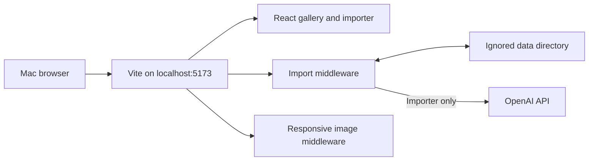

# Feature Implementation Plan: Local Mac Setup

## Status
- Planning state: Ready
- Implementation readiness: The current service can be started without code changes; the steps below separate the gallery-only setup from the optional AI importer setup.

## Problem and Outcome
### Problem
The repository contains a React client plus Vite-hosted local APIs, but a Mac user needs a verified sequence for installing the correct runtime, configuring private local state, starting the complete service, and distinguishing optional importer requirements from baseline gallery requirements.

### Desired user outcome
From the repository root on macOS, the user can start Wardrobe, open it at `http://localhost:5173`, see the gallery without API errors, and optionally enable and smoke-test the OpenAI-backed import flow.

### In scope
- macOS prerequisites and version checks.
- Dependency installation from the existing lockfile.
- Private `.env` and `data/` initialization.
- Development startup and local production-preview commands.
- Gallery, API, image-serving, and optional importer smoke tests.
- Common setup failures and recovery steps.

### Out of scope
- Changing application code or dependencies.
- Deploying Wardrobe or exposing it to the public internet.
- Provisioning an OpenAI account or API key.
- Importing the user's wardrobe as part of setup.
- Adding a process manager, container, database server, or test framework.

## Acceptance Criteria
- [ ] `node --version` reports Node.js 22 or newer and `npm --version` succeeds.
- [ ] `npm install` completes from the repository root using the committed `package-lock.json`.
- [ ] `npm run check` completes successfully.
- [ ] `npm run dev` starts the integrated service and `http://localhost:5173` loads in a Mac browser.
- [ ] `GET /api/import/wardrobe` returns JSON, including an empty array on a new wardrobe, rather than a 404 or client HTML.
- [ ] A new setup creates local runtime directories automatically and keeps `.env`, `data/`, personal photos, and generated assets untracked.
- [ ] The gallery shows its empty state or existing local records without a load error.
- [ ] When importer prerequisites are intentionally configured, `/api/import/config` reports them ready and the UI accepts an image for analysis.
- [ ] A production build can be served locally with `npm run preview` at `http://localhost:4173` when preview behavior is desired.

## Investigation Findings
### Relevant files and current responsibilities
- `README.md`: documents Node 22+, quick-start commands, ports, importer prerequisites, and supported environment variables.
- `GEMINI.md`: documents the local-first architecture, local database, middleware, and privacy constraints.
- `package.json`: defines the Vite development, build, preview, and required check commands; the project uses native ECMAScript modules.
- `package-lock.json`: pins the npm dependency graph and should remain the source of reproducible installs.
- `.env.example`: provides safe configuration names and defaults without credentials.
- `.gitignore`: excludes `.env*`, `data/`, `node_modules/`, and `dist/`, while retaining `.env.example`.
- `vite.config.mjs`: loads `.env`, binds development to `0.0.0.0`, configures the preview port, and installs both server middleware plugins.
- `scripts/import-job-api.mjs`: owns `/api/import/*`, initializes `data/jobs/` and `data/imported/`, and reads/writes `data/library.json`.
- `scripts/responsive-image-api.mjs`: mounts the `/_ipx` image transformer in development and preview.
- `src/App.jsx`: loads the local wardrobe from `/api/import/wardrobe` and renders the empty or populated gallery.
- `src/import-flow.jsx`: checks `/api/import/config` and drives the optional web import job workflow.
- `src/OptimizedImage.jsx`: sends eligible static images through `/_ipx`; API, data, and blob URLs bypass transformation.

### Current flow and architecture
`npm run dev` starts one Vite process. Vite serves the React application and mounts the import/file API plus the IPX image middleware. During configuration, the import plugin creates the configured data directory's `jobs/` and `imported/` children. The gallery then requests `/api/import/wardrobe`; absent `library.json` is treated as a new local wardrobe. No separate database or backend process is required.

The base gallery does not require `OPENAI_API_KEY`. The web importer's analysis and generated garment stages require the key. Modeled generation also requires a readable PNG at `WARDROBE_MODEL_REFERENCE`, whose default is `data/model-reference.png`.

### Dependencies and integration points
- Node.js 22+ and npm are the only system-level runtime prerequisites documented by the repository.
- npm installs Vite, React, Sharp, IPX, and the remaining JavaScript packages locally.
- Sharp is a native dependency; installation problems may depend on Node architecture/version and network access.
- The importer makes outbound HTTPS requests to the OpenAI API and can incur API usage charges.
- Ports are `5173` for development and `4173` for preview unless Vite selects another free development port.

### Constraints and challenges
- `.env` and everything in `data/` are private, ignored local state and must never be staged or committed.
- `npm run preview` requires a successful build first. It serves the integrated middleware, but development mode remains the normal local workflow.
- The server binds to all local interfaces (`0.0.0.0`). Use the localhost URL and do not add router forwarding or public tunnels as part of local setup.
- There is no automated test framework; `npm run check` is the required build validation and runtime behavior needs manual smoke testing.
- Existing `data/` must be preserved. Setup commands should use `mkdir -p data` and must not overwrite `library.json` or existing images.

## Technical Design
### Proposed architecture
Keep the existing single-process architecture unchanged. Use a two-tier setup:

1. Baseline local gallery: Node/npm, locked dependencies, optional blank `.env`, and Vite.
2. AI importer: baseline setup plus a valid `OPENAI_API_KEY`, outbound network access, and a private model-reference PNG for modeled outputs.

### User experience and state behavior
- With no records, the loaded application shows the first-piece empty state.
- With an existing `data/library.json`, the gallery loads those local records and their images.
- With missing importer configuration, the app remains usable as a gallery and reports the missing prerequisites in the importer rather than requiring them at server startup.
- If port 5173 is unavailable, the actual URL printed by Vite is authoritative; alternatively stop the conflicting process before retrying.

### Data and interface contracts
- `.env` is copied once from `.env.example` and edited locally. Minimum importer setting: `OPENAI_API_KEY`; model defaults may remain unchanged.
- `WARDROBE_MODEL_REFERENCE` defaults to `data/model-reference.png` and may be an alternate local path.
- `WARDROBE_DATA_DIR` is supported by server code and defaults to `data`; leave it unset for the standard layout.
- `GET /api/import/wardrobe` returns the array stored in `data/library.json`, or an empty array for a fresh setup.
- `GET /api/import/config` returns readiness information used by the import UI.
- Imported files are persisted beneath `data/imported/`; in-progress jobs use `data/jobs/`.

### Error handling and recovery
- Wrong Node version: install or select Node 22+, reopen the shell if needed, verify, and rerun `npm install`.
- Dependency/native-module failure: confirm the Mac terminal and Node installation use the intended architecture, then rerun the normal install; do not delete user data.
- Port collision: use Vite's printed alternate URL or terminate only the known process occupying port 5173.
- Gallery API 404: confirm the page is opened through Vite, not by opening `index.html` directly or using an unrelated static server.
- Importer unavailable: inspect `/api/import/config`, correct `.env` or the reference path, and restart Vite because environment configuration is loaded at process startup.
- OpenAI request failure: preserve the local job, verify connectivity/key/account status, and retry from the UI; do not publish the key in logs or support output.
- Corrupt `library.json`: make a private backup before manual repair. Do not replace an existing library with an empty file during setup.

### Privacy and security
- Keep the API key only in `.env`; never put it in shell history, plan files, screenshots, commits, or command output.
- Keep the reference photo, originals, job state, generated images, and `library.json` under ignored local storage.
- Treat the service as local development software. Binding to `0.0.0.0` can make it reachable from the LAN depending on macOS firewall settings, so do not expose or forward the port.
- Before any future commit, confirm `git status --short` does not show secrets or personal assets.

### Compatibility and migration
No schema migration or code modification is needed. Fresh local directories are created by middleware. Existing `.env` and `data/` are retained in place; setup must not overwrite them.

### Diagram

## Implementation Checklist
- [ ] Verify macOS Node/npm prerequisites.
- [ ] Install the committed dependency graph.
- [ ] Initialize configuration without overwriting existing private state.
- [ ] Start and smoke-test the integrated development service.
- [ ] Optionally configure and smoke-test the web importer.
- [ ] Validate the production build and optional preview.
- [ ] Confirm private files remain ignored and untracked.

## Step-by-Step Implementation
### Step 1: Verify the local runtime
- Files: `README.md`, `package.json`
- Changes: No repository changes. From the repository root, run `node --version` and `npm --version`. Require Node 22 or newer. The inspected machine currently reports Node `v26.2.0` and npm `11.13.0`, which satisfy the documented requirement.
- Contracts: Use a native macOS Node installation or a version manager; keep the selected Node version consistent between install and runtime.
- Edge cases: If `node` is absent or older, install/select a current Node release before proceeding. If multiple terminal architectures are used, keep Node and npm on the same architecture.
- Validation: Both version commands succeed and Node's major version is at least 22.

### Step 2: Install locked dependencies
- Files: `package.json`, `package-lock.json`, `node_modules/`
- Changes: Run `npm install` from `/Users/yannipeng/git-projects/wardrobe`. Do not modify dependency declarations merely to make initial setup pass.
- Contracts: npm installs local packages including Sharp and Vite according to the lockfile.
- Edge cases: Network/proxy failures and Sharp native binary installation failures should be diagnosed from npm's first error. Do not remove `data/` or `.env` while troubleshooting dependencies.
- Validation: `npm install` exits successfully and `npm run check` builds the client.

### Step 3: Initialize private local configuration
- Files: `.env.example`, `.env`, `.gitignore`, `data/`
- Changes: If `.env` does not exist, run `cp .env.example .env`. Do not overwrite an existing `.env`. Optionally run `mkdir -p data`; the server also creates required subdirectories automatically. Leave `WARDROBE_DATA_DIR` at its default unless a deliberate alternate private location is needed.
- Contracts: Baseline gallery setup may retain an empty `OPENAI_API_KEY`. For importer setup, edit `.env` locally and assign the key without printing it.
- Edge cases: Preserve any existing `data/library.json`, `data/imported/`, `data/jobs/`, and reference image.
- Validation: `git check-ignore .env data` identifies both as ignored; `git status --short` does not expose private setup files.

### Step 4: Start and verify the baseline gallery
- Files: `vite.config.mjs`, `scripts/import-job-api.mjs`, `scripts/responsive-image-api.mjs`, `src/App.jsx`
- Changes: Run `npm run dev`, keep that terminal open, and open `http://localhost:5173` in a browser.
- Contracts: One Vite process supplies the client, `/api/import/*`, and `/_ipx`; no separate server command exists.
- Edge cases: Follow the exact local URL printed by Vite if it selects a different port. Do not open `index.html` directly.
- Validation: The page renders; browser console has no startup exception; `curl -i http://localhost:5173/api/import/wardrobe` returns HTTP 200 and JSON; a fresh installation shows the empty gallery rather than an error.

### Step 5: Optionally enable and test AI import
- Files: `.env`, `data/model-reference.png`, `src/import-flow.jsx`, `scripts/import-job-api.mjs`
- Changes: Put a valid key in `.env`. To generate modeled images, copy a suitable private PNG to `data/model-reference.png` or set `WARDROBE_MODEL_REFERENCE` to its local path. Restart `npm run dev` after configuration changes.
- Contracts: Keep default `OPENAI_VISION_MODEL=gpt-5.4-mini`, `OPENAI_IMAGE_MODEL=gpt-image-2`, and `OPENAI_IMAGE_QUALITY=high` unless the user intentionally selects supported alternatives.
- Edge cases: Image generation incurs API usage. A key enables analysis and garment generation; a missing reference specifically prevents modeled generation. The input should remain private and untracked.
- Validation: `curl -s http://localhost:5173/api/import/config` reports the configured prerequisites; in the UI, add a non-sensitive test clothing photo, confirm analysis begins, then review the detected crop. Stop before costly later stages if only configuration readiness is being tested.

### Step 6: Validate build and local preview
- Files: `package.json`, `vite.config.mjs`, `dist/`
- Changes: Stop the development process or use a second terminal, run `npm run check`, then optionally run `npm run preview` and open `http://localhost:4173`.
- Contracts: `npm run check` currently delegates to `npm run build`; preview serves the generated bundle and integrated server middleware.
- Edge cases: Preview requires an existing successful build. Port 4173 must be available.
- Validation: The check exits zero. If preview is used, repeat the gallery and wardrobe endpoint smoke tests on port 4173.

## Validation Strategy
### Automated checks
- `node --version`
- `npm --version`
- `npm install`
- `npm run check`
- While development is running: `curl -i http://localhost:5173/api/import/wardrobe`
- With importer intentionally configured: `curl -s http://localhost:5173/api/import/config`
- Privacy check: `git check-ignore .env data` and `git status --short`

### Manual scenarios
1. Open the fresh gallery and confirm the empty state loads with no wardrobe-fetch error.
2. If local records already exist, open an item and confirm its garment/modeled images render.
3. Filter the gallery categories and confirm the interface stays responsive.
4. Open the import flow without credentials and confirm it explains missing setup while the gallery remains usable.
5. With importer configuration enabled, submit one test image and confirm detection reaches crop review.
6. If testing modeled generation, approve the crop and garment, then confirm the modeled review image appears and the approved item persists after a page reload.
7. Optionally load the production preview and repeat the gallery/API check on port 4173.

### Expected results
The integrated service starts from one command, local APIs return JSON, the gallery is usable independently of AI configuration, configured imports persist under `data/`, responsive images load, the production build passes, and no private runtime files appear in Git status.

## Risks and Alternatives
### Risks and mitigations
- OpenAI cost or accidental upload of sensitive images: use a deliberate test photo, understand that importer stages call external APIs, and stop after the minimum smoke-test stage.
- LAN exposure from `host: "0.0.0.0"`: use localhost only, rely on the macOS firewall, and avoid forwarding/tunneling the port.
- Native Sharp install mismatch: use a supported Node version and consistent Mac architecture.
- Existing local wardrobe damage: never recreate or empty `library.json`; back it up privately before any manual repair.
- Environment changes not taking effect: restart Vite after editing `.env`.

### Assumptions
- The user is running the repository directly on a current macOS installation.
- The user has permission to install or select Node.js locally.
- Baseline success means the gallery and local APIs run; AI importing is optional.
- The standard ignored `data/` location is acceptable for private wardrobe files.

### Alternatives considered
- Docker/container setup: rejected because the repository provides no container configuration and Node/npm is the smaller supported path.
- Separate frontend/backend processes: rejected because Vite intentionally hosts both middleware layers.
- A standalone static server for `dist/`: rejected for full functionality because the gallery depends on `/api/import/*`; use the configured Vite preview instead.
- Requiring API credentials during initial setup: rejected because the baseline gallery works without them and keeping the tiers separate reduces secret handling and API cost.

### Unresolved questions
- None blocking. The only optional user choice is whether to enable the OpenAI-backed web importer now or run the gallery alone.
